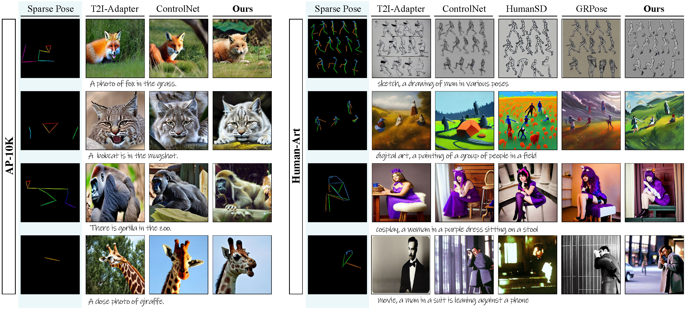
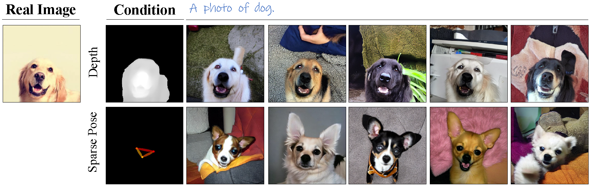
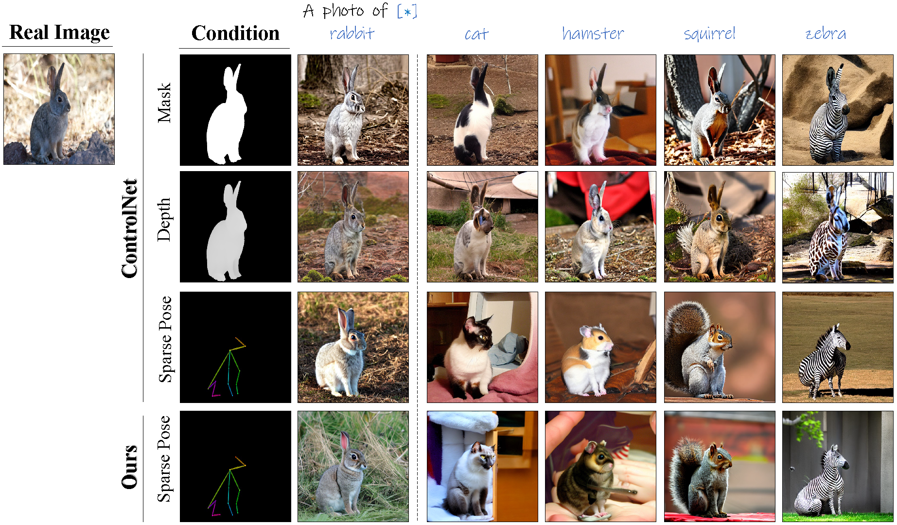
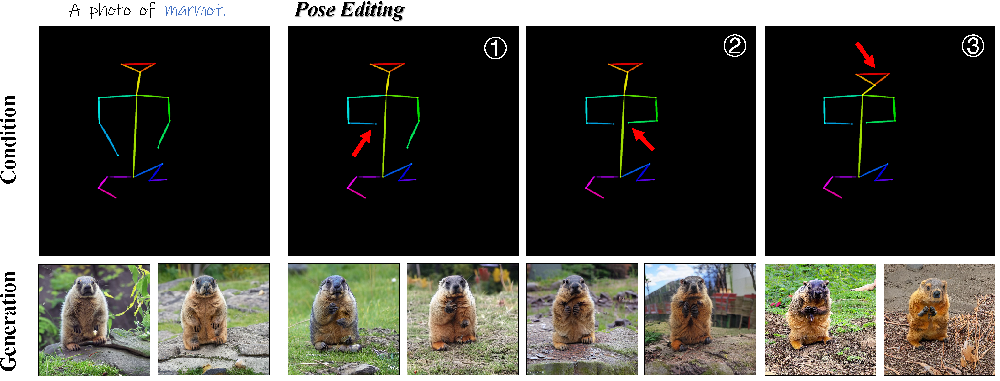

<h1 align="center">
     Rethink Sparse Signals for Pose-guided Text-to-image Generation
</h1></h1> 
<p align="center">
<a href="https://arxiv.org/abs/2506.20983"></a>
</p>


> Wenjie Xuan, Jing Zhang, Juhua Liu, Bo Du, Dacheng Tao

This is the official implementation for the paper "*Rethink Sparse Signals for Pose-guided Text-to-image Generation*", accepted by ICCV 2025. We propose a Spatial-Pose ControlNet, namely *SP-Ctrl*, which equips sparse signals with robust controllability for pose-guided image generation. Our work features an improved spatial-pose representation and a keypoint-concept learning and alignment strategy. Please refer to our paper for more details.


## :fire: News

- **[2025/07/06]**: The codes for training, inference, evaluation, and visualization are released. Some checkpoints are available on AP-10K and HumanArt.  
- **[2025/06/26]**: Our work is accepted by ICCV 2025. We are preparing to release the code in a few weeks. 


## :round_pushpin: Todo

- [ ] Further curation of the code. 
- [ ] Release the checkpoints of our SP-Ctrl on AP-10K. Coming soon!
- [x] Release the checkpoints of our SP-Ctrl on HumanArt.  
- [x] Release the checkpoints of pre-trained ControlNet on AP-10K with different conditions.  
- [x] Release the code for training, inference, evaluation, and visualization. 
- [x] Release the code for preparing datasets. 


## :sparkles: Highlight


- **We rethink the sparse signals for pose-guided T2I generation and propose *SP-Ctrl*,** a spatial-pose ControlNet that enables precise pose alignment with sparse signals. It reveals the potential of sparse signals in spatially controllable generations. 
- **A Spatial-Pose Representation for better pose instructions**. We introduce a Spatial-Pose Representation with learnable keypoint embeddings to enhance the expressiveness of sparse pose signals.
- **A Keypoint-Concept Learning strategy to encourage text-spatial alignment**. We propose Keypoint Concept Learning, a novel strategy that enhances keypoint focus and discrimination, enhancing details and improving pose alignment.
- **Better pose accuracy, diversity and cross-species generation ability**. Experiments on animal- and human-centric T2I generation validate that our method achieves performance comparable to dense signals. Moreover, our method advances in diversity and cross-species generation. 


## :hammer_and_wrench: Install

**Recommended**:  `Python=3.11` `torch=2.1.2` `CUDA=12.2` `diffusers=0.25.1` `mmpose==0.24.0` `mmcv==1.5.0` `mmdet==2.26.0`

```shell
# set up repository 
git clone https://github.com/DREAMXFAR/SP-Ctrl.git
cd SP-Ctrl-main

# install conda environment 
conda env create -n spctrl python=3.11
pip install -r requirements.txt

# [optional] If you want to run the evaluation with ViTPose, please prepare another environment with mmpose. We provide our environment configuration yaml for reference. And we recommond to follow the official instructions of ViTPose here: https://github.com/ViTAE-Transformer/ViTPose
conda env create -n vitpose python=3.11
pip install -r vitpose_requirement.txt
```


## :pushpin: Checkpoints

You can download the following checkpoints and put them in `controlnet_checkpoint/`. 

| Model                     | Download                                                     | Key    | Notations                                     |
| ------------------------- | ------------------------------------------------------------ | ------ | --------------------------------------------- |
| ControlNet-ap10k-mask     | [link](https://pan.baidu.com/s/105X1ilHOfSu92Yxp69KVtg?pwd=2025) | `2025` | ControlNet for AP10K conditioned on mask.     |
| ControlNet-ap10k-depth    | [link](https://pan.baidu.com/s/1-viY31UYLz48YxL0DP-xvw?pwd=2025) | `2025` | ControlNet for AP10K conditioned on depth.    |
| ControlNet-ap10k-openpose | [link](https://pan.baidu.com/s/1Ni9Ia3kyYv6jei2N06gKxw?pwd=2025) | `2025` | ControlNet for AP10K conditioned on openpose. |
| Ours-ap10k                | —                                                            | —      | Available in a few weeks.                     |
| Ours-humanart             | [link](https://pan.baidu.com/s/18Zx4sElGpwkXi78YFGQ5gQ?pwd=2025) | `2025` | SP-Ctrl for HumanArt.                         |


## :rocket: Getting Started

> Here we suppose you are in `SP-Ctrl-main/`

#### Demo

1. Download our released checkpoints and put them under `./controlnet_checkpoint`

2. We provide a demo for inference on HumanArt. Run the following script and the output is stored in `./output_dir/demo`

   ```shell
   # 1. config the checkpoint path, prompt first
   # 2. run the following code for inference
   bash inference/submit_inference_humanart.sh
   ```
   
   

#### Date Preparation

1. Download the AP-10K dataset and HumanArt dataset. 

   - `AP-10K`: https://github.com/AlexTheBad/AP-10K
   - `HumanArt`: https://github.com/IDEA-Research/HumanArt

2. Pre-process the raw dataset and generate new `jsonl` file for training and validation. Run the following scripts. Note these `.py` files are just for reference, and you can process the raw dataset on your own. We recommend to have a look at the code here before running them. 

   ```shell
   # generate jsonl for training. Note that mmpose is required.
   cd custom_dataset/utils
   
   # prepare our spa-textual pose, which renders the pose with their index. details refer to the code, where we use the index of keypoints for drawing. 
   # for kpt, idx=kpt_id; for skeleton, idx=sks_id+50. refer to gen_keypoint_spatext.py, line 93 for details
   python gen_keypoint_spatext.py 
   
   # [optional] generate other type of conditions, some models are necessary to download. 
   python get_mask_with_sam.py  # for samhq mask
   python gen_pose_gt.py  # for openpose
   python gen_depth_map.py  # for zeodepth
   
   # generate jsonl for dataset
   python prepare_image_json.py
   ```

3. If you follow the provided scripts, the final dataset structure should be organized as follows. Note this is just used for our data-loaders including `coco_keypoints_offline_dataset.py` and `coco_humanart_keypoints_offline_dataset.py` under `./custom_datasets/`. Remember to configure the global variables in these files. You can also write your own dataloader. 

   ```shell
   - AP-10K_triplet
     - data/  # AP-10K images 
     - pose_kptindex/ # spatext pose
     - [optional] sam_hq_mask/ # mask
     - [optional] mmpose_skeleton/ # openpose
     - [optional] zeo_depth_masked/  # masked depth map
     - categories.jsonl  # category information 
     - train_split1.jsonl  # train information 
     - val_split1.jsonl  # val information
   
   - HumanArt_triplet
     - images/  # HumanArt images 
     - annotations/  # HumanArt annotations
     - pose/  # HumanArt pose annotations
     - humanart_kptindex/ # spatext pose
     - [optional] humanart_openpose/ # openpose
     - categories.jsonl  # category information 
     - train_split1.jsonl  # train information 
     - val_split1.jsonl  # val information
   ```

#### Training

1. Download the [SD_v1.5](https://huggingface.co/runwayml/stable-diffusion-v1-5) parameters from hugging-face. Put the SD checkpoints in anywhere you like. 

2. Configure the hyper-parameters in `./train.sh` and run the scripts.  

   ```shell
   # train, here is the recommended configuration for training
   sh train.sh
   ```

   > **basic configurations**
   >
   > `--pretrained_model_name_or_path` # Path to pretrained model or model identifier from uggingface.co/models.
   >
   > `--controlnet_model_name_or_path` # Path to pretrained controlnet model or model identifier from huggingface.co/models. If not specified controlnet weights are initialized from unet.
   >
   > `--output_dir` # The output directory where the model predictions and checkpoints will be written.
   >
   > `--dataset_name` # Set datset, e.g. ap10k or humanart
   >
   > `--conditioning_mode` # Set the condition mode for custom offline dataset, e.g. spatext or openpose.
   >
   > `--use_extra_mask` # Whether to add extra mask conditions
   >
   > **Spatext related configurations**
   >
   > `--add_keypoint_prompt` # The percentage of adding keypoint names to prompt
   >
   > `--enable_learnable_kpttoken`  # Use learnble textual embeddings of the keypoint name text.
   >
   > `--spatext_cond_channels` the  # num of output channel for spatext_embedding layer.
   >
   > `--spatext_init_emb`  # the initial spatext embedding, None for random, or `xxx.bin` to load.
   >
   > `--spatext_skeleton_type`  # SPATEXT_SKELETON_TYPE, the skeleton embedding.
   >
   > `--spatext_enable_learn_kpt`  # If True, let the model learn spatext embedding of the keypoint.
   >
   > `--spatext_enable_learn_sks`  # If True, let the model learn spatext embedding of the skeleton.
   >
   > `--spatext_detach_kpt_grad_from_sks`  # If true, detach the gradient from keypoint interpolation.
   >
   > `--spatext_freeze_embedding`  # If true, freeze the parameters of the spatext embedding layers
   >
   > `--spatext_layer_version`  # {sigmoid_version} the spatext embedding layer version
   >
   > **Cross-attention loss configurations**
   >
   > `--add_cross_attn_loss` # Add cross-attention loss.
   >
   > `--attn_loss_weight` # Weight for cross-attention loss, only work when add_cross_attn_loss=True.
   >
   > `--heatmap_type` # the heatmap type, use the `whole` or `partition` heatmap
   >
   > `--attn_loss_type` # the type of cross-attention map loss, bce or mse, default mse. 
   >
   > `--attn_loss_start_timestep` # From this timestep to compute cross-attention loss.
   >
   > `--attn_loss_end_timestep` # To this timestep, stop to compute the cross-attention loss.
   >
   > `--attn_loss_select_layer_type` # Select only some layers to compute the cross-attention loss.{down_blocks.0,down_blocks.1,down_blocks.2,mid_block}
   >
   > `--attn_loss_detach_query` # Detach the loss backward to init noise in attention map.
   > `--text_encoder_lr` # learning rate for text encoder.
   >
   > `--text_encoder_lr_scheduler` # set the learning rate schedule for text_encoder.

#### Inference

1. To run inference, please download the pre-trained checkpoints first. Then set the path in the codes and run the following scirpts.  

   ```shell
   # for ap10k-mask,depth,openpose,and our spatial-pose
   bash inference/submit_inference_ap10k.sh
   # for humanart-spatial-pose
   bash inference/submit_inference_humanart.sh
   ```

2. We provide some utils for convience. 

   ```shell
   python inference/get_pose_token_prompt.py  # generate prompt with keypoint tokens from the jsonl file, only support ap10k
   ```

3. Here is a tool for visualizing cross-attention maps. 

   ```shell
   cd tools/cross-attention-map
   # correct the path of models in this file before running it. 
   python single_inference.py
   ```


#### Evaluation

1. Here are codes for evaluating with [ViTPose](https://github.com/ViTAE-Transformer/ViTPose).  To run the evaluation, you need to prepare the environment for ViTPose following the instructions [here](https://github.com/ViTAE-Transformer/ViTPose?tab=readme-ov-file#usage), and put our checkpoints under `./checkpoints`. 

1. Download the pre-trained ViTPose checkpoints. We use the official pre-trained [ViTPose+-H](https://github.com/ViTAE-Transformer/ViTPose?tab=readme-ov-file#animal-datasets-ap10k-apt36k) for AP-10K, and mmpose [ViTPose-H-humanart-coco](https://mmpose.readthedocs.io/en/latest/model_zoo/body_2d_keypoint.html#topdown-heatmap-vitpose-on-humanart). 

1. Run the test with provided scripts. We provide our config files of ViTPose under `tools/eval_vitpose_metrics/config` for reference. We recommend users to have a look at the codes before running them. 

   ```shell
   # 1. Setup the config files. 
   
   # 2. Conduct evaluation with ViTPose 
   sh /tools/eval_vitpose_metrics/submit_test.sh
   sh /tools/eval_vitpose_metrics/submit_infer.sh  # output with visualized results
   ```


##  :medal_sports:Performance

> For more details, you can refer to our paper. 



| Dataset      | Method      | Pose mAP  | FID       | CLIP-Score |
| ------------ | ----------- | --------- | --------- | ---------- |
| **AP-10K**   | T2I-Adapter | 48.16     | 27.29     | 25.52      |
|              | ControlNet  | 44.25     | 19.40     | 24.77      |
|              | **Ours**    | **55.63** | **18.52** | **23.86**  |
| **HumanArt** | T2I-Adapter | 38.37     | 40.01     | 27.36      |
|              | ControlNet  | 45.26     | 26.69     | 27.84      |
|              | HumanSD     | 49.92     | 35.18     | 27.35      |
|              | GRPose      | 50.93     | 28.85     | 27.95      |
|              | **Ours**    | **29.30** | **25.94** | **9.11**   |


## :art: Applications

> Here we showcase several advantages of our method. More details please refer to our paper. 

1. Our method can synthesize images with precisely aligned poses and diverse shapes. 

   

2. Our method can realize cross-species generation with accurate pose control.

   

3. Enjoying the sparse pose, our method is more friendly to pose editing. 

   


## :bulb: FAQs

> If you find some questions, please feel free to contact us. We will response as soon as possible. 

- [x] None


## 💗 Acknowledgements

- Our implementation is greatly based on the [diffusers](https://github.com/huggingface/diffusers), [textual-inversion](https://github.com/rinongal/textual_inversion), [ControlNet](https://github.com/lllyasviel/ControlNet), [attention-map-diffusers](https://github.com/wooyeolbaek/attention-map-diffusers). Thanks for their wonderful works and all contributors.


## :black_nib: Citation

If you find our findings helpful in your research, please consider giving this repository a :star: and citing:

```bibtex
@misc{xuan2025rethinksparsesignalsposeguided,
      title={Rethink Sparse Signals for Pose-guided Text-to-image Generation}, 
      author={Wenjie Xuan and Jing Zhang and Juhua Liu and Bo Du and Dacheng Tao},
      year={2025},
      eprint={2506.20983},
      archivePrefix={arXiv},
      primaryClass={cs.CV},
      url={https://arxiv.org/abs/2506.20983}, 
}
```

